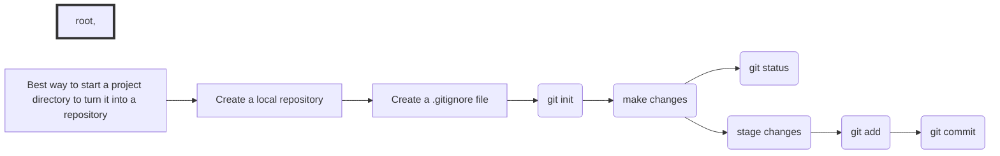

# Graph from LR

---

title: Graph to show a diagram from left to right

---

```mermaid
graph LR
style root, id2, id3, A, B, C, D, E, F fill:#f9f,stroke:#333,stroke-width:4px, text-align:center, font-size: 16px;
root["`Best way to start a project directory to turn it into a repository`"]
    root --> id2["`Create a local repository`"]
    id2 --> id3[Create a .gitignore file] 
    id3 --> A(git init)
    A --> B(make changes)
      B --> C(git status)
      B --> D(stage changes)
      D --> E(git add)
      E --> F(git commit)

```
