<!--markdownlint-disable MD041-->
### Learning Git - Anna Skoulikari

Special notes extract from the book chapter by chapter

_**Chapter 2 - Local Repositories**_

The four important areas when working with 'Git':

Working directory  
The staging area  
The commit history  
Local repository
  
A local repository is represented by a hidden directory  _**.git**_  that exists within a project directory.

Normally Git users initialize a Git repository by using _**.git**_  the command with no additional options; however,
in the Rainbow project, you will initialize the repository by using _**git init**_ with -b option (which is short for --initial-branch)
and pass in the name main.

```bash
rainbow $ git init -b main
```

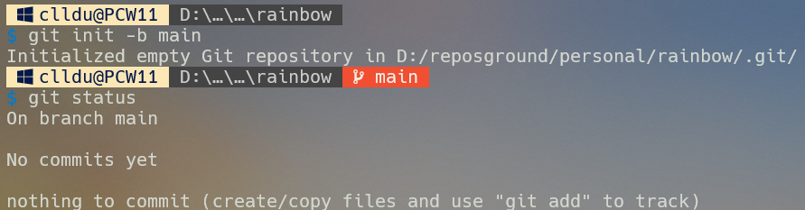

_**Working directory**_

  It contains the files and directories in the project directory that represent one version of a project.
  It´s like a workbench where you add, edit and delete files and directories.

_**Staging area**_
  
  It´s similar to a rough draft space. It is where you can add and remove files, when you are preparing what you want to include in the next saved version of your project (your next commit).  
  The staging area is represented by a file in the _**.git**_ directory called index.
  The index file is created only if you have added at least one file to the staging area in your project.

_**What is a commit?**_
  
A commit in Git is basically one version of a project. You can think of it as a snapshot of a project , or a standalone
version of a project that contains references to all the files that are part of that commit.

Every commit has a _hash_ (sometimes called a commit ID). This is a unique 40-character hash composed of letters and numbers that acts like a name for the commit, providing a way to refer to it.

An example of a commit hash is  **3e432908a9fc08e44b2ea9c37be60615fcf4739a**

In reality, you only need the first characters of a commit hash to refer to a commit. So, for the example hash just given , you can just use 3e43290 to refer to the commit.

_**Introducing the commit history**_

The commit history is where you can think of your commits existing. It is represented by the _objects_ directory inside the _**.git**_ directory.

_**Adding a file to a git project**_

Use your editor to create a file called 'rainbowcolors.txt' inside your rainbow project directory.
On line one add "Red is the first color of the rainbow." and save the file.

  _**What to notice:**_  
  The rainbowcolors.txt file is inside the rainbow project directory; therefore, it is in the working directory.

  Even though the rainbowcolors.txt file is in the working directory, it is not part of your repository. It has not been added to the staging area and it has not yet been included in a commit in the commit history.

  _**Chapter 3 - Making a commit**_

  Why do we make commits?
  In chapter 2, you learned that a commit basically represents one version of a project. Every time you want to save a new version of a project, you can make a commit.

  Committing is important because it allows you to back up your work and avoid the frustration of losing unsaved work.Once you´ve made a commit, that work is saved, and you´ll be able to go back and look at that commit to see what your project looked like at that point in time.

  _**The two steps to make a commit**_

- [ ] Add all files you want to include in the next commit to the staging area.
- [ ] Make a commit with a commit message.

```bash
rainbow $ git status
```

  Show the state of the working directory and the staging area.

   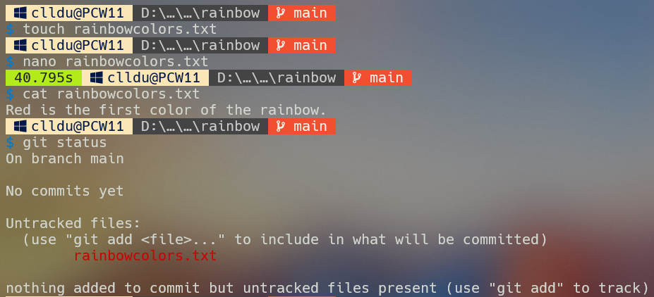

 What to notice:

- [ ] - [ ]  The _git status_ output informs you there are 'No commits yest'. In other words, the commit history does not contain commits at this time.

- [ ]  The rainbowcolors.txt file is an untracked file.

- [ ]  Git gives you the instructions that you need to add the untracked file to the staging area: 'use "git add _file_" to include in what will be committed.

_**Adding files to the staging area**_

To add files to the staging area, you use the 'git add' command. If you want do add individual files that you have edited to the staging area, the you can pass in the filename or filenames to the git add command as arguments.
To add all the files you have edited or changed in your working directory, you can use 'git add' command with the '-A' option, (which stands for "all").

```bash
git add <filename>

git add <filename> <filename> ...

git add -A
```

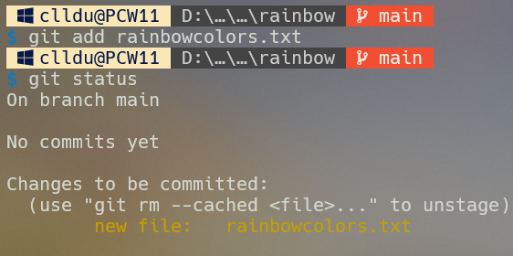
  
_**Make a commit**_

It's important to note that commit is both a verb and a noun. In Git, the verb _'to commit'_ means to save something, and
the noun (a commit) means a version of a project.

`git commit -m "<message>"`

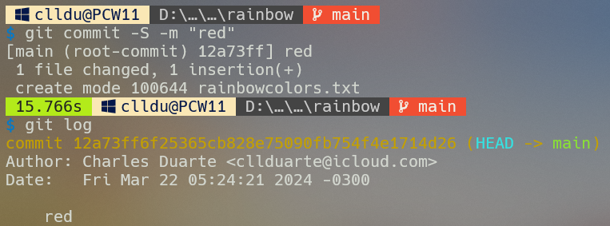  

What to notice:
The output of the 'git commit' command shows the first seven characters of the commit hash for the red commit, which is
_12a73ff_.

_**Viewing a list of commits**_

To view a list of commits in the commit history, you use the _'git log_'   command.

1 - Commit hash  
2 - Author name and e-mail address  
3 - Data and time commit was made  
4 - Commit message

_**Chapter 4 - "Branches"**_

_State of the local repository_
There is one commit in the rainbow repository, the red commit.

_Why do we use branches?_

- [ ] To work on the same project in different ways.
- [ ] To help multiple people work on the same project at the same time.

One common pattern for working with branches is to have one official primary line of development  - the main or primary branch -
and off of that to create secondary branches, called topic branches or feature branches, that are used to work on just a specific part of the project.

These topic branches are short-lived; they are ultimately combined or incorporated back into the primary branch and the deleted.

The two process you can use to integrate one branch into another are called merging and rebasing.

_What exactly are branches in git?_
Branches in git are movable pointers to commits. When you list the commits in a local repository using <!-- git log -->
command you can see information about which branches point to which commit.

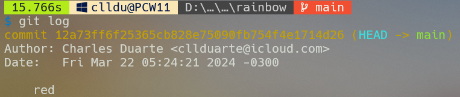

What to notice:
In the git log output, next to the commit hash inside parentheses you see HEAD → main.
'HEAD' - We'll discuss later.

In the rainbow repository , the main branch points to the red commit.

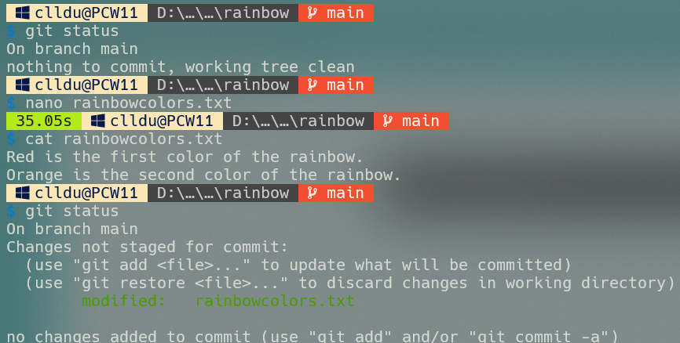  

What to notice:
> In the first git status the rainbowcolors.txt in an unmodified file. It is not listed in the git status output.

In the last 'git status', the rainbowcolors.txt file is a modified file.It's now listed in the git status output.

The rainbowcolors.txt file is not staged for commit; in other words, it has not been added to the staging area.

You just saw the rainbowcolors.txt file went from being an unmodified file to a modified when you edit it and saved your changes.

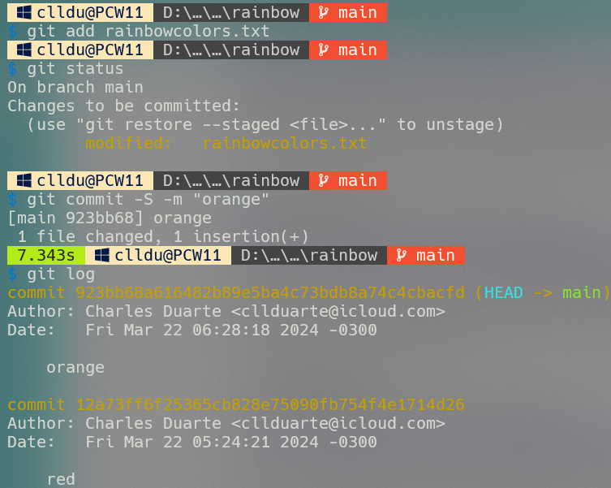

What to notice:
The rainbowcolors.txt file is staged for commit; in other words, it has been added to the staging area.

You made a new commit, the orange commit.

The text 'HEAD -> main' appears in parentheses next to the orange commit.

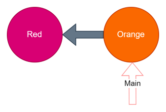

The main branch points to the orange commit.

The gray arrow represents the 'parent link'.

The parent commit of the orange commit is the red commit; this is why the orange commit points back to the red commit.

The black arrow are used to represent branch pointers.

To check which commit is the parent of a given commit, you can use the '_git cat-file -p _commit-hash_' command with '-p' option and pass in a commit hash.

!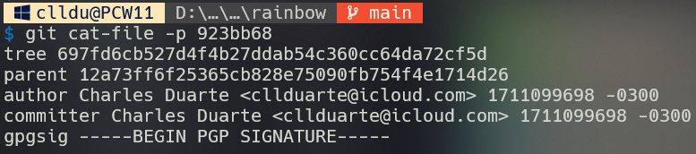

_**Creating a Branch**_

At the moment, you only have one local branch, called **main**.
To list branches in a local repository, you can use the `git branch` command.
To create a new branch, you can pass the name of a branch that doesn't exist yet to this command. Note that branch names cannot contain spaces.

git branch - List local branches

git branch <new_branch_name>  - Create a new branch

!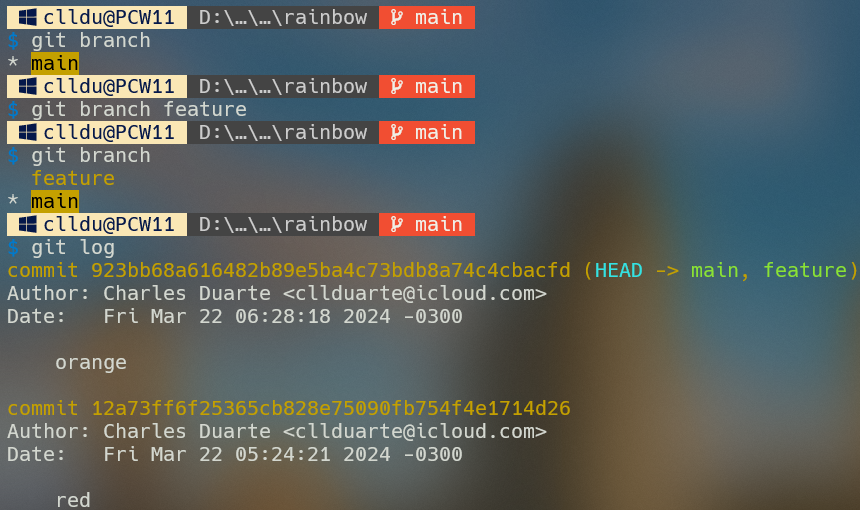

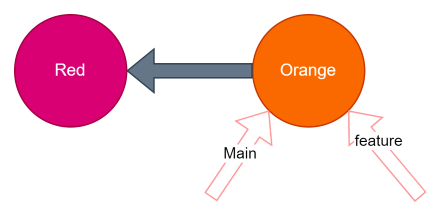

What to notice:
You made a new branch called feature that points to the orange commit.

In that above diagram you can see that there are now two arrows, representing the **main** and **feature** branches, pointing to the orange commit.A new branch will initially point to the commit that you were on when you made the branch.In this case, you can say that you "made the feature branch off of the main branch". That is why the feature branch and main branch both now point to the same commit.

In the `git log` output in the image above, in the parentheses next to the orange commit, you should see (HEAD -> main, feature).

What is HEAD?
HEAD is simple a pointer that tells you which branch you are on. The name HEAD is always in capital letters, but this is simply a convention; it is not an acronym.

NOTE
There times where you can be on a commit that is not pointed to by a branch. Git calls this "detached HEAD state".

Another way of knowing which branch you're currently on is to look at the output of either the `git branch` command or the `git log` command.
In the `git branch` output, the branch you are currently on will have an asterisk next to it.

_**Switching Branches**_

To work on another branch (or line of development) in Git project, you have to switch onto that branch.Another way of saying this in Git terminology is that you have to "check out" another branch.

You must explicitly instruct Git that you want to switch onto a branch. You can do this using either the `git switch` command or the `git checkout` command, passing in the name of the branch that you want to switch onto.

git switch <branch_name> - switch branches

git checkout <branch_name> - switch branches

The only purpose of the git switch command is to switch branches, while the git checkout command can do more things.

The git switch (or git checkout) command does three things when used to switch branches:

1 - It changes the HEAD pointer to point to the branch you are switching onto.
2 - It populates the staging area with a snapshot of the commit you are switching onto.
3 - It copies the contents of the staging area into the working directory.

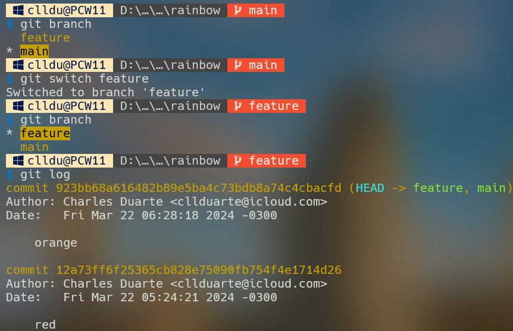

What to notice:
In the image above, the git log output shows that HEAD points to the feature branch.

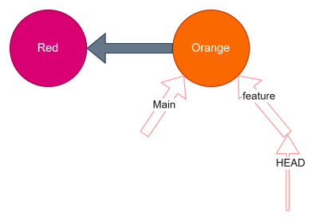

_**Working on a separate branch**_

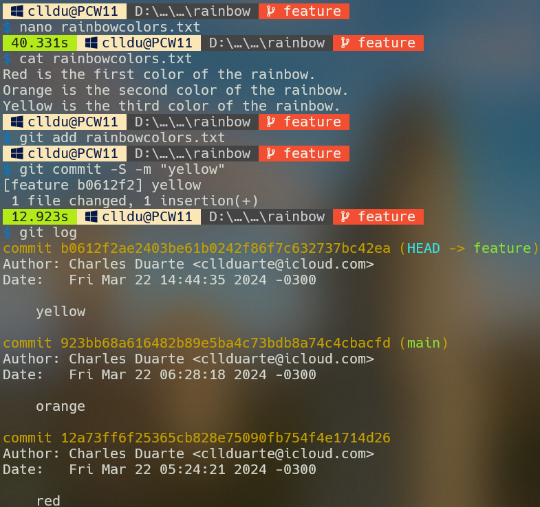

What to notice:
The feature branch points to the latest commit, the yellow commit.
The main branch still points to the orange commit.

_**Chapter 5 - Merging**_
In the last chapter, you learned about branches, and we discussed how they allow you to work on the same project in different ways and to collaborate with other people on a project.

In this chapter, you are going to learn about integrating changes from one branch into another.
In Git, there are two way to do this: merging and rebasing.

Our focus will be on merging  type '_fast-forward merges_' and _'three-way merges'_.
