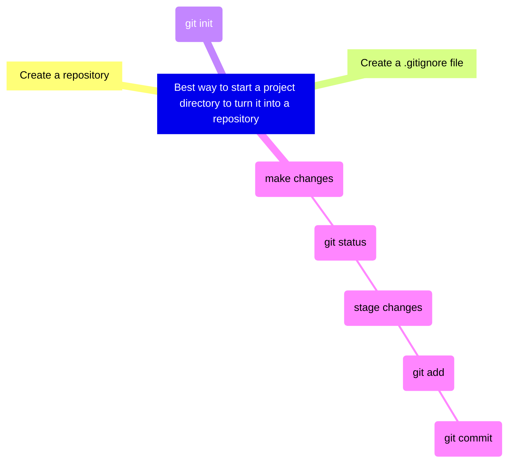

# Mindmap

---

title: Mindmap

---

```mermaid

mindmap
root["`Best way to start a project directory to turn it into a repository`"]
    root --> id2[Create a repository]
    ide2 --> id3[Create a .gitignore file] 
    id3 --> A(git init)
    A --> B(make changes)
      B --> C(git status)
        C --> D(stage changes)
           D --> E(git add)
             E --> F(git commit)

```
