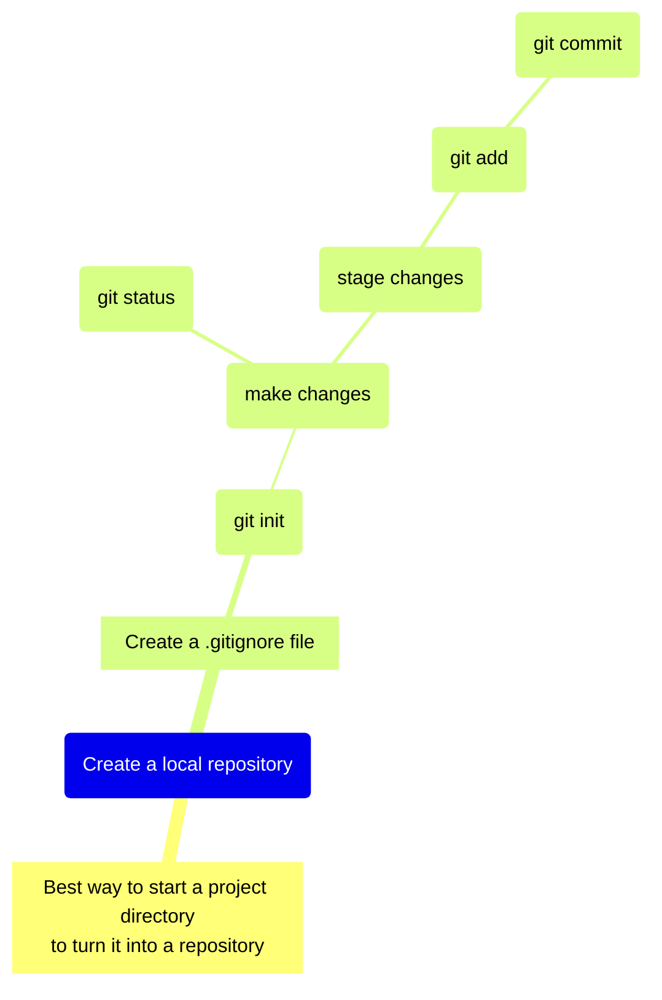

# Mindmap to represent a git process

---

title:MindMap

---

```mermaid

mindmap
id1("`Create a local repository`") 
  id2[Best way to start a project directory
  to turn it into a repository]
  id3[Create a .gitignore file] 
      
   A (git init)
    B (make changes)
     C (git status)
     D(stage changes)
      E(git add)
        F(git commit)
      
```
