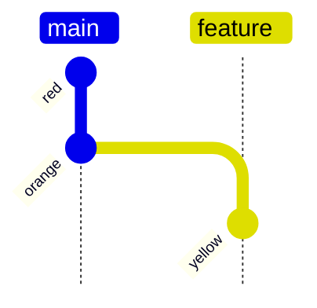

# Learning Git  - A Hands-On and Visual Guide to the Basics of Git

---
title: Rainbow repo

---

$ git hist
b0612f2 2024-03-22 Charles Duarte (HEAD -> feature) yellow
923bb68 2024-03-22 Charles Duarte (main) orange
12a73ff 2024-03-22 Charles Duarte red

O id foi trocado do hash pelas cores que são colocadas na mensagem do 'commit'
