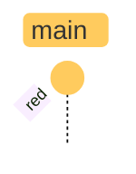
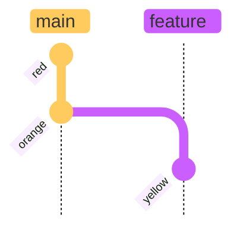
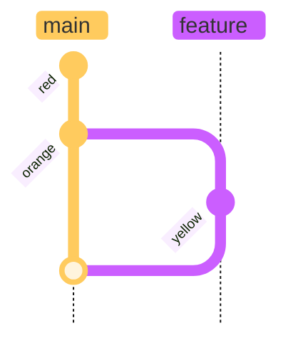

<!--markdownlint-disable MD041-->
## Review the book "Learning Git" using 'Gitgraph" to represent repositories chapter by chapter with git commands

---

title: Chapter 4

---

---

title: Chapter 5

---

---

title: Chapter 6

---

