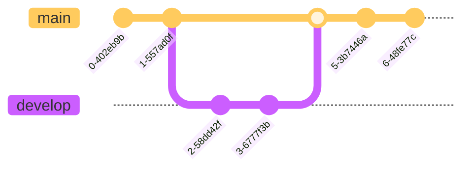

# Gitgraph usando parâmetros de configuração

---

title: Example Git diagram

---

```mermaid

%%{init: { 'logLevel': 'debug', 'theme': 'base', 'gitGraph': {'showBranches': true, 'showCommitLabel':true,'mainBranchOrder': 0}} }%%

gitGraph
   commit
   commit
   branch develop
   checkout develop
   commit
   commit
   checkout main
   merge develop
   commit
   commit

```
