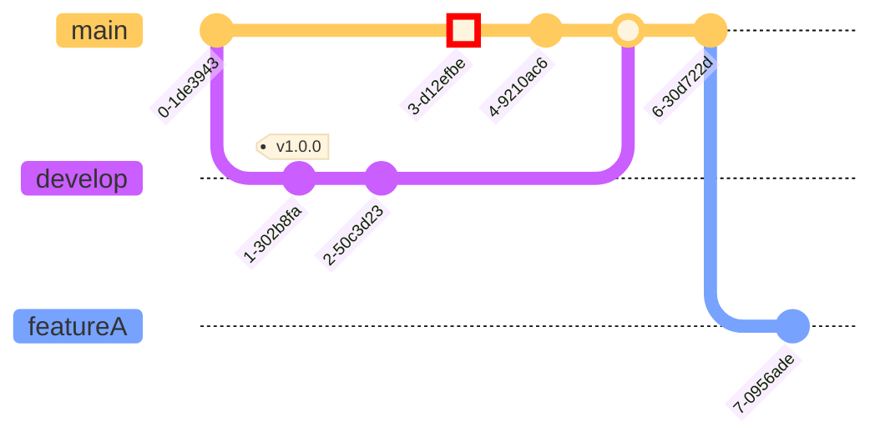

# Teste mudança de cores dos commits

---

title: Example Git diagram

---

```mermaid
    %%{init: { 'logLevel': 'debug', 'theme': 'base' , 'themeVariables': {
              'gitInv0': '#ff0000'
       } } }%%
       gitGraph
       commit
       branch develop
       commit tag:"v1.0.0"
       commit
       checkout main
       commit type: HIGHLIGHT
       commit
       merge develop
       commit
       branch featureA
       commit


```
